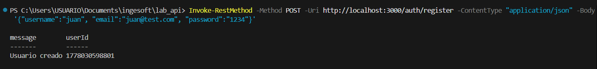
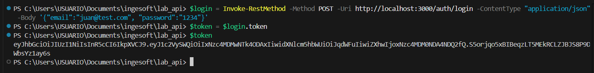
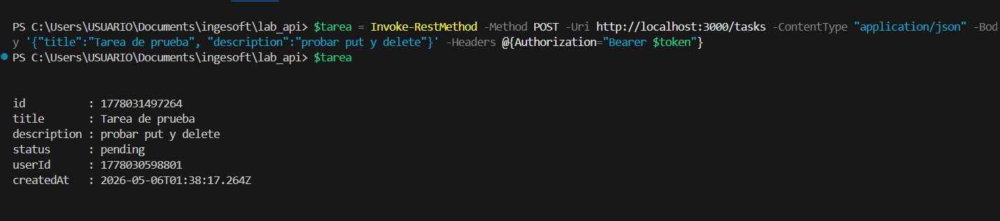
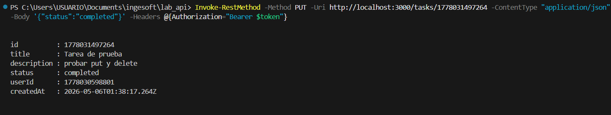
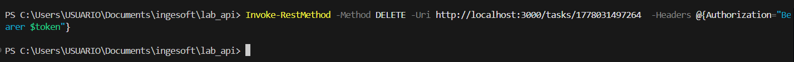
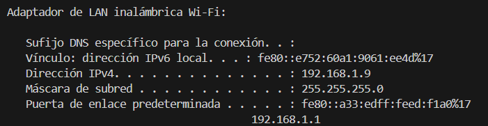
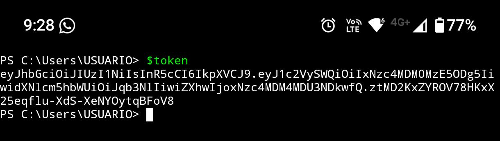
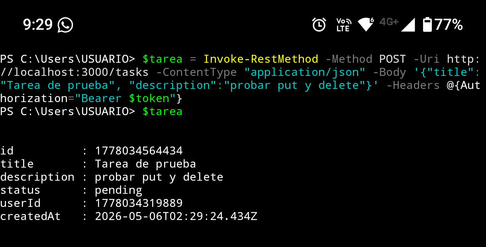
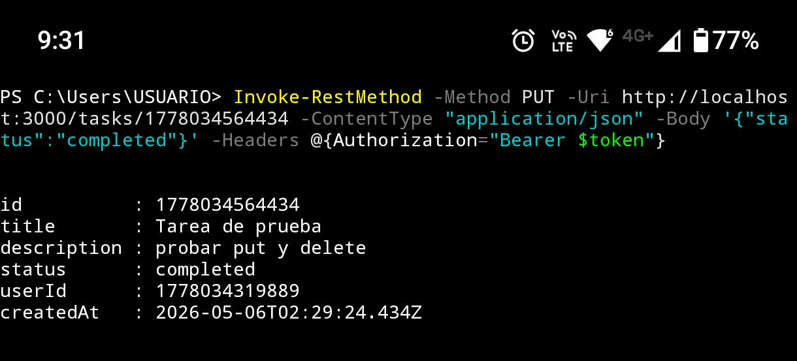

# SSH

### Objetivo
Consumir la API desde la terminal (pwsh) y validar los endpoints de autenticación y tareas.

### Requests realizados

| # | Request | Endpoint | Status Code | Observación |
|---|---|---|---|---|
| 1 | Register | `/auth/register` | 201 | Crea usuario y devuelve `userId` |
| 2 | Login | `/auth/login` | 200 | Devuelve `token` JWT |
| 3 | Create task | `/tasks` | 201 | Crea tarea con `status: pending` |
| 4 | Update task | `/tasks/:id` | 200 | Cambia estado a `completed` |
| 5 | Delete task | `/tasks/:id` | 204 | Elimina la tarea |

### Resultados

#### Register
- Se registra un nuevo usuario y la API retorna el `userId` correspondiente.
- **Request:** `POST /auth/register`
- **Status code:** 201

#### Login
- Se autentica el usuario registrado y se obtiene el token JWT necesario para los endpoints protegidos.
- **Request:** `POST /auth/login`
- **Status code:** 200

#### Create task
- Se genera una tarea vinculada al usuario autenticado, con estado inicial `pending`.
- **Request:** `POST /tasks`
- **Status code:** 201

#### Update task (PUT)
- Se modifica el estado de la tarea a `completed` usando su `id`.
- **Request:** `PUT /tasks/:id`
- **Status code:** 200

#### Delete task
- Se elimina la tarea y el servidor responde sin contenido.
- **Request:** `DELETE /tasks/:id`
- **Status code:** 204

### Evidencia (capturas)

#### Register

#### Login

#### Create task

#### Update task

#### Delete task

---

## 2) SSH

### Objetivo
Consumir la API desde otro dispositivo utilizando un túnel SSH (Termux en Android).

### Teoría breve
- SSH establece un canal cifrado entre dos equipos para la transmisión segura de datos.
- El port forwarding permite exponer el puerto 3000 del computador como si fuera local en el teléfono Android.
- Termux permite abrir el túnel desde Android y ejecutar requests contra `http://localhost:3000`.

### Requests realizados

| # | Request | Endpoint | Status Code | Observación |
|---|---|---|---|---|
| 1 | Register | `/auth/register` | 201 | Usuario creado desde Android |
| 2 | Login | `/auth/login` | 200 | Token generado desde Android |
| 3 | Create task | `/tasks` | 201 | Tarea creada desde Android |
| 4 | Update task | `/tasks/:id` | 200 | Estado actualizado desde Android |

### Resultados

#### Túnel SSH
- Se obtiene la IP local del computador y se establece la conexión SSH desde Termux en Android.
- A partir de esto, los requests se ejecutan contra `http://localhost:3000` desde el dispositivo móvil.

#### Validación de endpoints
- El flujo de register, login, POST y PUT responde de manera idéntica a la Parte 1.
- Se confirma que el token se transmite correctamente por el túnel y permite acceder a los endpoints protegidos.

### Evidencia (capturas)

#### IP local del PC

#### Register y Login

#### Create task

#### Update task
