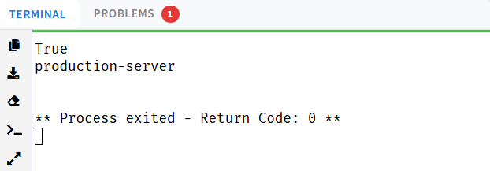
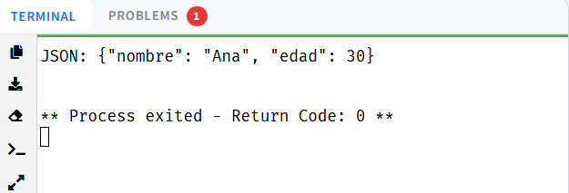
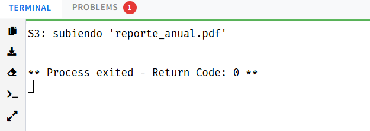
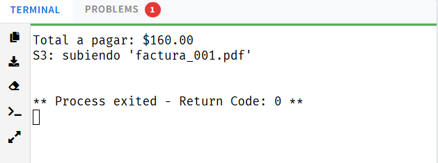

# Patrones de Diseño en Python

Actividad práctica sobre patrones de diseño implementados en Python. Se cubren:
- 2 patrones creacionales (Singleton y Factory Method).
- 1 patrón estructural combinado con el creacional (Adapter + Factory).
- 1 patrón de comportamiento que integra los anteriores (Strategy + Factory + Adapter).

---

## 1) Patrón Creacional: Singleton

### Definición
Garantiza que una clase cuente con una única instancia durante toda la ejecución del programa, ofreciendo un punto de acceso global a ella.

### Ejemplo (Python)

```python
class DatabaseConnection:
    _instance = None

    def __new__(cls):
        if cls._instance is None:
            cls._instance = super().__new__(cls)
            cls._instance.host = "localhost"
            cls._instance.port = 5432
        return cls._instance


if __name__ == "__main__":
    db1 = DatabaseConnection()
    db2 = DatabaseConnection()

    db1.host = "production-server"

    print(db1 is db2)      # True
    print(db2.host)        # production-server
```

### Explicación
- La primera vez que se instancia `DatabaseConnection`, el objeto se almacena en `_instance`.
- En llamadas posteriores se retorna esa misma referencia, evitando crear nuevas conexiones.

### Evidencia (captura)


---

## 2) Patrón Creacional: Factory Method

### Definición
Proporciona una interfaz para la creación de objetos, delegando en las subclases la decisión de qué clase concreta instanciar.

### Ejemplo (Python)

```python
from abc import ABC, abstractmethod


class Exportador(ABC):
    @abstractmethod
    def exportar(self, datos: str) -> None:
        pass


class ExportadorCSV(Exportador):
    def exportar(self, datos: str) -> None:
        print(f"CSV: {datos}")


class ExportadorJSON(Exportador):
    def exportar(self, datos: str) -> None:
        print(f"JSON: {datos}")


class ExportadorFactory(ABC):
    @abstractmethod
    def crear(self) -> Exportador:
        pass


class CSVFactory(ExportadorFactory):
    def crear(self) -> Exportador:
        return ExportadorCSV()


class JSONFactory(ExportadorFactory):
    def crear(self) -> Exportador:
        return ExportadorJSON()


if __name__ == "__main__":
    factory = JSONFactory()
    exportador = factory.crear()
    exportador.exportar('{"nombre": "Ana", "edad": 30}')
```

### Explicación
- `ExportadorFactory` declara el método `crear()` sin definir el tipo concreto.
- `CSVFactory` y `JSONFactory` determinan qué implementación concreta se construye.

### Evidencia (captura)


---

## 3) Patrón Estructural: Adapter (combinado con Factory)

### Definición
Permite la colaboración entre clases con interfaces incompatibles, actuando como intermediario que traduce las llamadas de una interfaz a otra.

### Idea de combinación
- Factory Method se encarga de instanciar el proveedor de almacenamiento.
- El servicio externo expone una API diferente a la esperada.
- El Adapter convierte la llamada estándar `guardar()` al método real del servicio.

### Ejemplo (Python)

```python
from abc import ABC, abstractmethod


class Almacenamiento(ABC):
    @abstractmethod
    def guardar(self, archivo: str) -> None:
        pass


class S3Client:
    def upload_file(self, filename: str) -> None:
        print(f"S3: subiendo '{filename}'")


class S3Adapter(Almacenamiento):
    def __init__(self, cliente: S3Client) -> None:
        self.cliente = cliente

    def guardar(self, archivo: str) -> None:
        self.cliente.upload_file(archivo)


class AlmacenamientoFactory(ABC):
    @abstractmethod
    def crear(self) -> Almacenamiento:
        pass


class S3Factory(AlmacenamientoFactory):
    def crear(self) -> Almacenamiento:
        return S3Adapter(S3Client())


if __name__ == "__main__":
    factory = S3Factory()
    almacenamiento = factory.crear()
    almacenamiento.guardar("reporte_anual.pdf")
```

### Explicación
- `S3Client` expone `upload_file`, no `guardar`.
- `S3Adapter` traduce la interfaz estándar al método del cliente real.
- `S3Factory` construye el adaptador sin que el código cliente conozca los detalles del SDK.

### Evidencia (captura)


---

## 4) Patrón de Comportamiento: Strategy (combinado con Factory + Adapter)

### Definición
Encapsula una familia de algoritmos intercambiables y permite seleccionar uno de ellos en tiempo de ejecución, sin modificar el código que lo utiliza.

### Idea de combinación
- La estrategia determina cómo se aplica un descuento al subtotal.
- El proveedor de almacenamiento se obtiene vía Factory y se adapta con Adapter.

### Ejemplo (Python)

```python
from abc import ABC, abstractmethod


class EstrategiaDescuento(ABC):
    @abstractmethod
    def aplicar(self, subtotal: float) -> float:
        pass


class SinDescuento(EstrategiaDescuento):
    def aplicar(self, subtotal: float) -> float:
        return subtotal


class DescuentoVIP(EstrategiaDescuento):
    def aplicar(self, subtotal: float) -> float:
        return subtotal * 0.80  # 20 % de descuento


class Almacenamiento(ABC):
    @abstractmethod
    def guardar(self, archivo: str) -> None:
        pass


class S3Client:
    def upload_file(self, filename: str) -> None:
        print(f"S3: subiendo '{filename}'")


class S3Adapter(Almacenamiento):
    def __init__(self, cliente: S3Client) -> None:
        self.cliente = cliente

    def guardar(self, archivo: str) -> None:
        self.cliente.upload_file(archivo)


class AlmacenamientoFactory(ABC):
    @abstractmethod
    def crear(self) -> Almacenamiento:
        pass


class S3Factory(AlmacenamientoFactory):
    def crear(self) -> Almacenamiento:
        return S3Adapter(S3Client())


class GestorPedido:
    def __init__(self, descuento: EstrategiaDescuento, factory: AlmacenamientoFactory) -> None:
        self.descuento = descuento
        self.factory = factory

    def procesar(self, subtotal: float, nombre_archivo: str) -> None:
        total = self.descuento.aplicar(subtotal)
        print(f"Total a pagar: ${total:.2f}")
        almacenamiento = self.factory.crear()
        almacenamiento.guardar(nombre_archivo)


if __name__ == "__main__":
    gestor = GestorPedido(DescuentoVIP(), S3Factory())
    gestor.procesar(200, "factura_001.pdf")
```

### Explicación
- `GestorPedido` aplica la estrategia de descuento (`SinDescuento` o `DescuentoVIP`) al subtotal recibido.
- El almacenamiento se obtiene mediante Factory Method y se integra a través del Adapter.
- Los tres patrones colaboran sin que el cliente quede acoplado a ninguna implementación concreta.

### Evidencia (captura)
