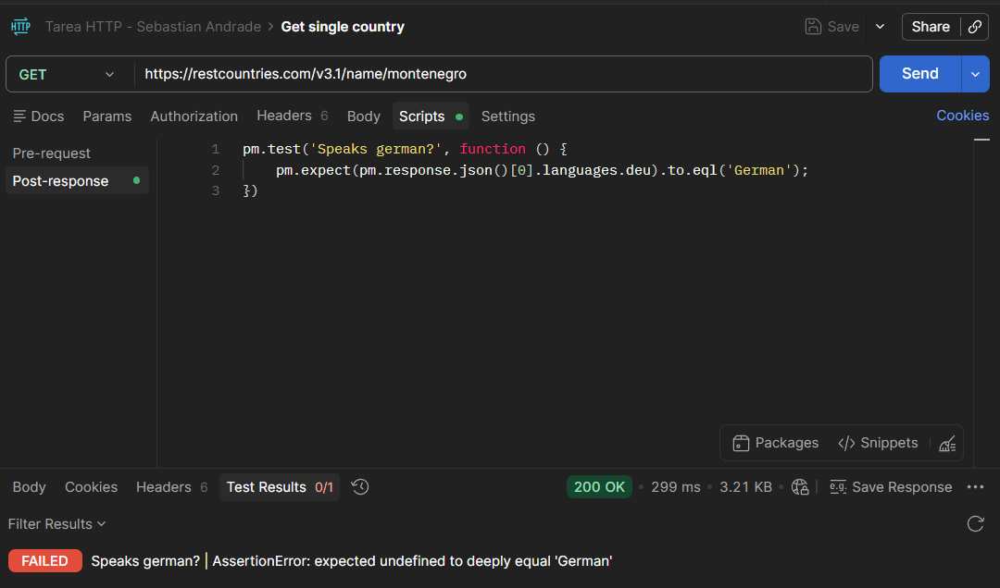
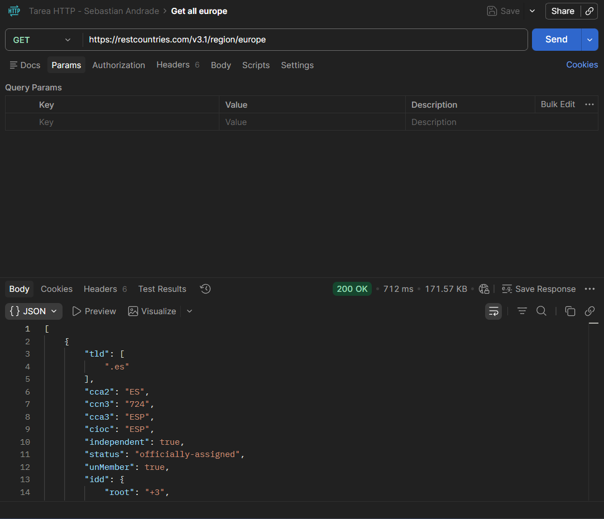
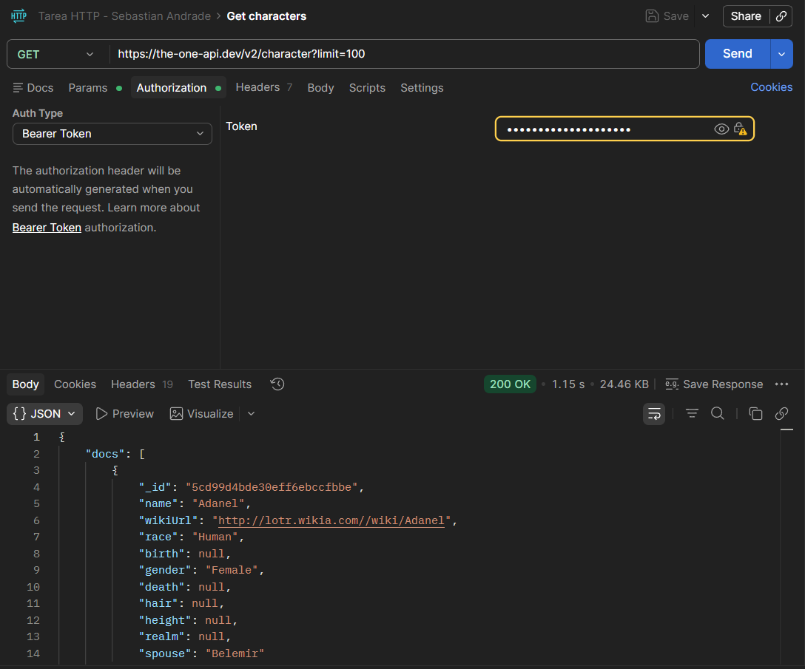
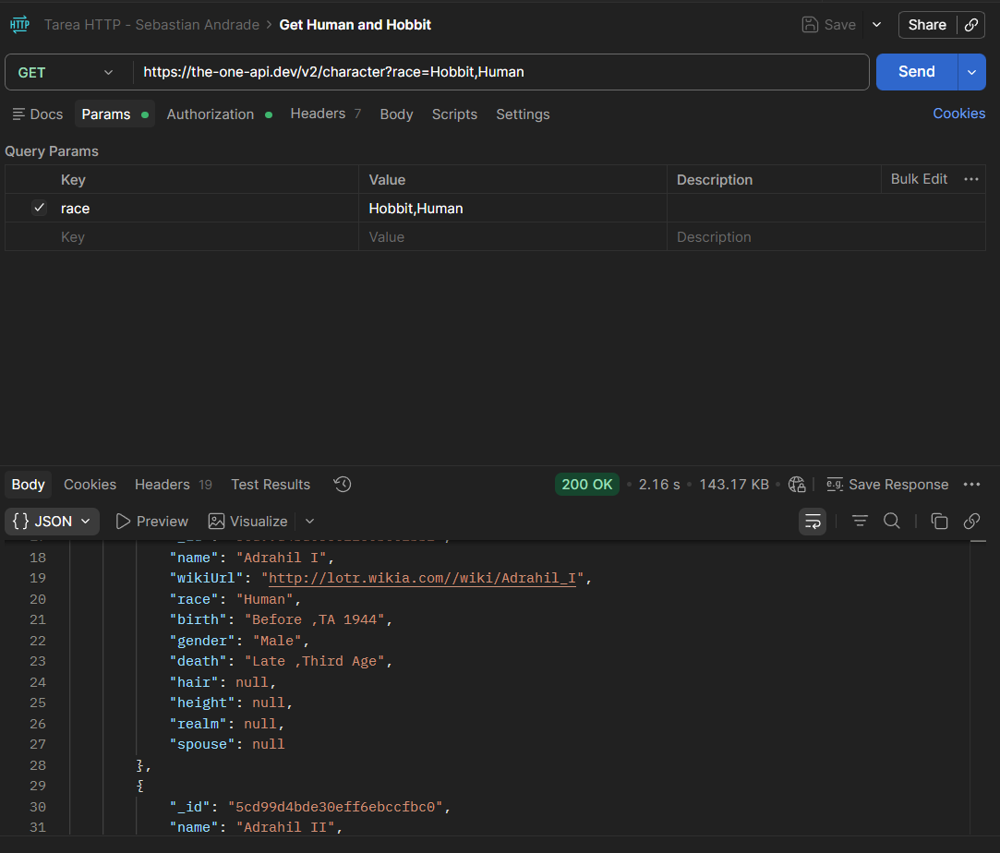
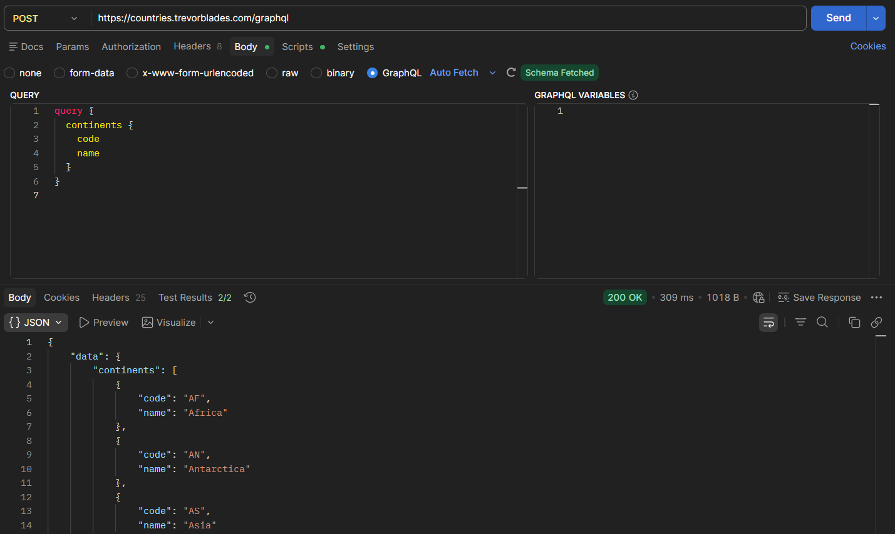
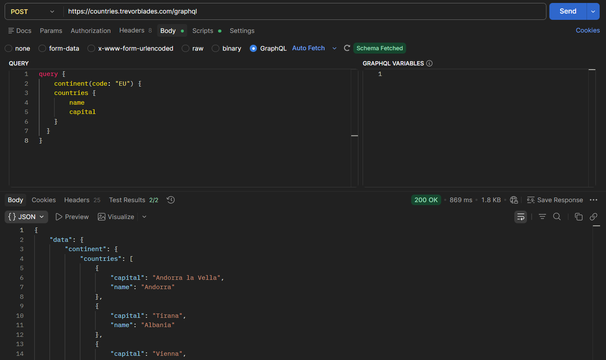
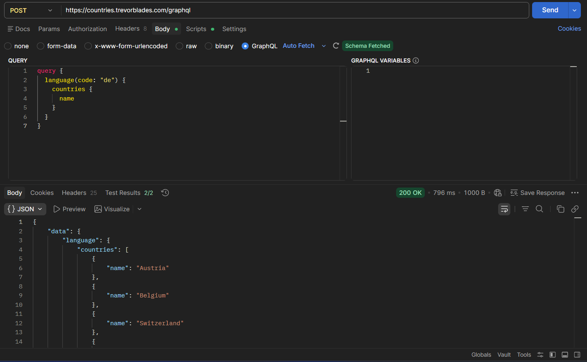
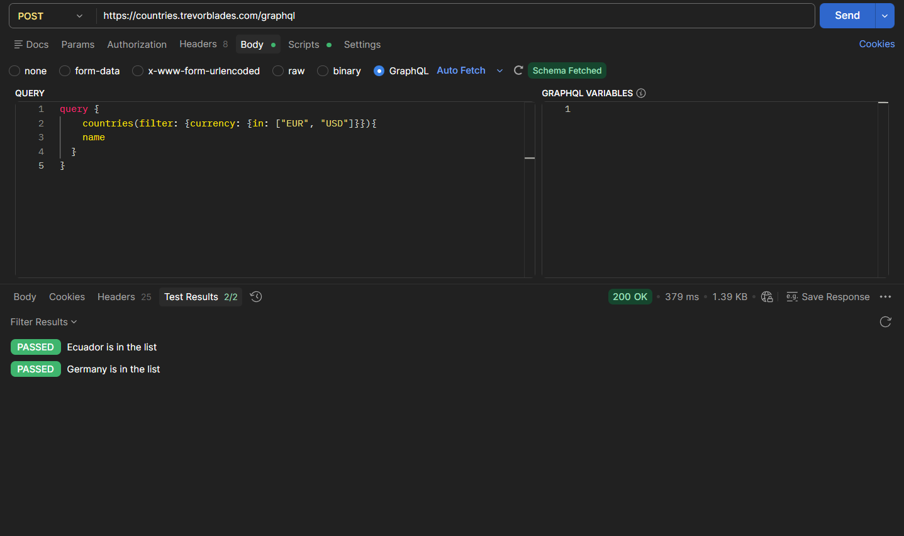

# Informe de Laboratorio — Consumo de APIs REST y GraphQL

**Estudiante:** Sebastián Andrade Cedano

---

## Parte 1: REST

### APIs utilizadas

Fueron consumidas tres APIs públicas distintas: **REST Countries**, **CoinGecko** y **The One API**. Las dos primeras fueron seleccionadas por interés personal en las áreas de geografía y criptomonedas respectivamente, mientras que la tercera fue incorporada con el propósito de explorar el uso de autenticación mediante Bearer Token dentro de Postman.

### Requests realizadas

#### 1. Get single country — REST Countries
Se consultó información sobre Montenegro, verificando los idiomas hablados en dicho país.

> **Nota**: El resultado del test es Failed, esto es esperado, debido a que el test quiere verificar si se habla Alemán y en Montenegro no se habla Alemán, esto se hizo a proposito para probar que sucedia si un test fallaba.



**Test implementado:**
```javascript
pm.test('Speaks german?', function () {
    pm.expect(pm.response.json()[0].languages.deu).to.eql('German');
})
```

---

#### 2. Get all Europe — REST Countries
Se obtuvo el listado completo de países pertenecientes a la región de Europa.



*(Sin tests automatizados)*

---

#### 3. Crypto price — CoinGecko
Se consultó el precio actual de Monero (XMR) en dólares estadounidenses, verificando que su valor supere los 100 USD.


**Test implementado:**
```javascript
pm.test('Check if price is over 100 dollars', function () {
    const body = pm.response.json();
    pm.expect(body.monero.usd).to.be.greaterThan(100);
})
```

---

#### 4. Get characters — The One API
Se obtuvo un listado de 100 personajes del universo de El Señor de los Anillos, utilizando autenticación mediante Bearer Token.



*(Sin tests automatizados)*

---

#### 5. Get Human and Hobbit — The One API
Se filtraron los personajes de la API según la raza, obteniendo únicamente Humanos y Hobbits mediante el uso de query parameters.



*(Sin tests automatizados)*

---

### Códigos de estado

En todas las requests realizadas fue recibido el código de estado **200 OK**.

### ¿Usa token?

The One API requiere autenticación mediante **Bearer Token**, el cual es configurado en Postman desde la pestaña *Authorization*, seleccionando el tipo *Bearer Token* e ingresando el valor correspondiente.

### ¿Qué se aprendió diferente a JSONPlaceholder?

A diferencia de JSONPlaceholder, estas APIs exponen estructuras de respuesta más complejas y permiten el uso de **query parameters** para filtrar resultados directamente desde la URL. Adicionalmente, fue practicado el uso de **Bearer Token** como mecanismo de autenticación, identificando el lugar correcto dentro de la interfaz de Postman donde dicho token debe ser configurado.

---

## Parte 2: GraphQL

Todas las queries fueron realizadas contra la API pública **[countries.trevorblades.com/graphql](https://countries.trevorblades.com/graphql)** mediante requests de tipo POST con el body en formato GraphQL.

> **Nota:** Para manejar GraphQL dentro de postman, se manejó como peticiones HTTP de tipo POST y con el GraphQL en el request body, pues era la forma más adecuada de poder exportar la colección en un .json (https://community.postman.com/t/how-to-export-graphql-collection/45147/2).

---

### Requests realizadas

#### 1. Get continents with code
Fueron obtenidos todos los continentes junto con su código identificador.



**Query:**
```graphql
query {
  continents {
    code
    name
  }
}
```

**Tests implementados:**
```javascript
const data = pm.response.json().data;
const continents = data.continents;

pm.test("Number of continents is correct", function () {
    pm.expect(continents).to.have.lengthOf(7);
});

pm.test("Europe code is EU", function () {
    const europe = continents.find(c => c.name === "Europe");
    pm.expect(europe).to.not.be.undefined;
    pm.expect(europe.code).to.equal("EU");
});
```

---

#### 2. Get Europe capitals
Fueron obtenidas las capitales de todos los países pertenecientes al continente europeo.



**Query:**
```graphql
query {
  continent(code: "EU") {
    countries {
      name
      capital
    }
  }
}
```

**Tests implementados:**
```javascript
const data = pm.response.json().data;
const countries = data.continent.countries;

pm.test("Capital of Andorra is Andorra la Vella", function () {
    const andorra = countries.find(c => c.name === "Andorra");
    pm.expect(andorra).to.not.be.undefined;
    pm.expect(andorra.capital).to.equal("Andorra la Vella");
});

pm.test("Capital of Austria is Vienna", function () {
    const austria = countries.find(c => c.name === "Austria");
    pm.expect(austria).to.not.be.undefined;
    pm.expect(austria.capital).to.equal("Vienna");
});
```

---

#### 3. Get languages with code
Fue obtenido el listado completo de idiomas registrados junto con su código correspondiente.


**Query:**
```graphql
query {
  languages {
    code
    name
  }
}
```

**Tests implementados:**
```javascript
const data = pm.response.json().data;
const languages = data.languages;

pm.test("Arabic code is ar", function () {
    const arabic = languages.find(l => l.name === "Arabic");
    pm.expect(arabic).to.not.be.undefined;
    pm.expect(arabic.code).to.equal("ar");
});

pm.test("Language with code 'am' is Amharic", function () {
    const amharic = languages.find(l => l.code === "am");
    pm.expect(amharic).to.not.be.undefined;
    pm.expect(amharic.name).to.equal("Amharic");
});
```

---

#### 4. Get German-speaking countries
Fueron obtenidos todos los países en los que el alemán es un idioma oficial.



**Query:**
```graphql
query {
  language(code: "de") {
    countries {
      name
    }
  }
}
```

**Tests implementados:**
```javascript
const data = pm.response.json().data;
const countries = data.language.countries;

pm.test("Austria is in the list of German-speaking countries", function () {
    const austria = countries.find(c => c.name === "Austria");
    pm.expect(austria).to.not.be.undefined;
});

pm.test("United States is not in the list of German-speaking countries", function () {
    const usa = countries.find(c => c.name === "United States");
    pm.expect(usa).to.be.undefined;
});
```

---

#### 5. Countries that use USD or EUR
Fue obtenido el listado de países cuya moneda oficial es el dólar estadounidense (USD) o el euro (EUR), aplicando un filtro mediante el campo `currency`. Esta fue considerada la query más compleja del laboratorio por el uso de filtros con múltiples valores.



**Query:**
```graphql
query {
  countries(filter: { currency: { in: ["EUR", "USD"] } }) {
    name
  }
}
```

**Tests implementados:**
```javascript
const data = pm.response.json().data;
const countries = data.countries;

pm.test("Ecuador is in the list", function () {
    const ecuador = countries.find(c => c.name === "Ecuador");
    pm.expect(ecuador).to.not.be.undefined;
});

pm.test("Germany is in the list", function () {
    const germany = countries.find(c => c.name === "Germany");
    pm.expect(germany).to.not.be.undefined;
});
```

---

### Reflexión sobre GraphQL

**¿Qué diferencia fue encontrada respecto a REST?**

La principal diferencia identificada es que en GraphQL se realiza una única request a un solo endpoint, especificando exactamente los campos que se desean obtener en la respuesta. En REST, cada recurso cuenta con su propio endpoint y la estructura del response es fija, independientemente de los datos que sean requeridos. Esto hace que GraphQL resulte más eficiente cuando solo se necesita un subconjunto de la información disponible.

**¿Cuántos requests REST serían necesarios para reemplazar la query más compleja?**

La query más compleja fue la de países filtrados por moneda (USD o EUR). Para replicar este comportamiento en REST serían necesarios al menos dos requests: uno para obtener los países que usan USD y otro para los que usan EUR, seguido de una consolidación manual de ambos resultados en el cliente. En caso de que la API REST no dispusiera de un filtro por moneda, sería necesario obtener la totalidad de los países y aplicar el filtro del lado del cliente.

**¿En qué proyecto real se usaría GraphQL?**

GraphQL sería utilizado en el proyecto del curso, dado que su uso resultó intuitivo y eficiente. La capacidad de solicitar únicamente los datos necesarios en cada consulta lo convierte en una herramienta adecuada para aplicaciones donde la estructura de los datos requeridos varía según el contexto o la vista.
